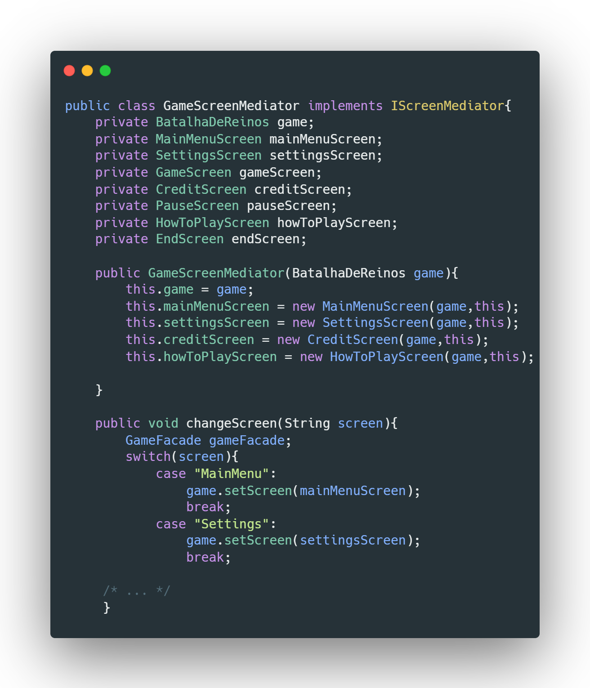
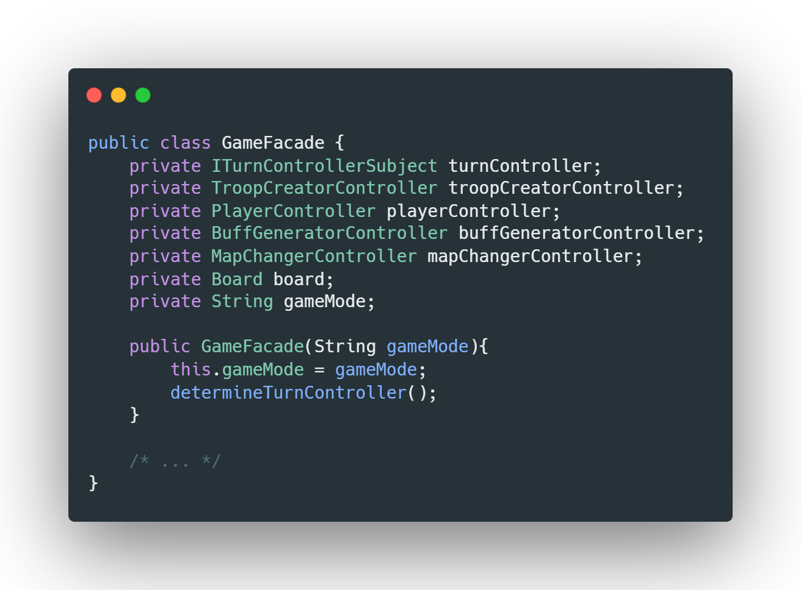
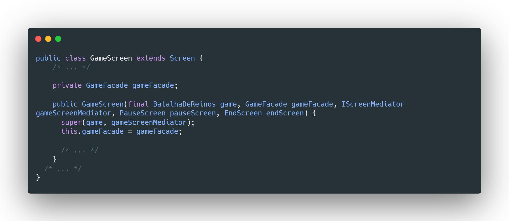
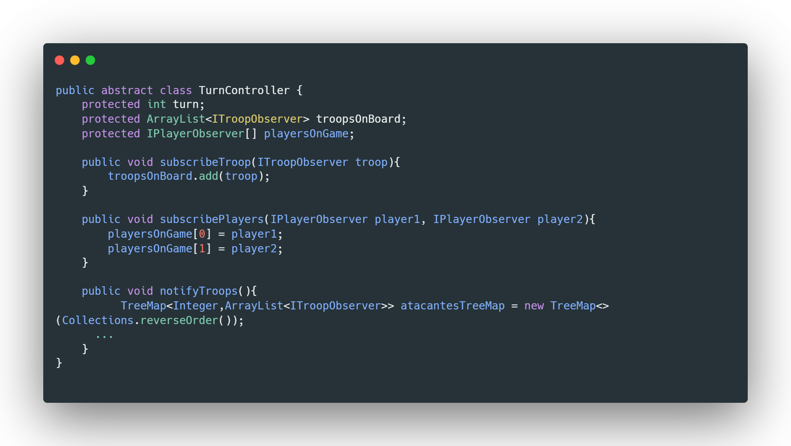
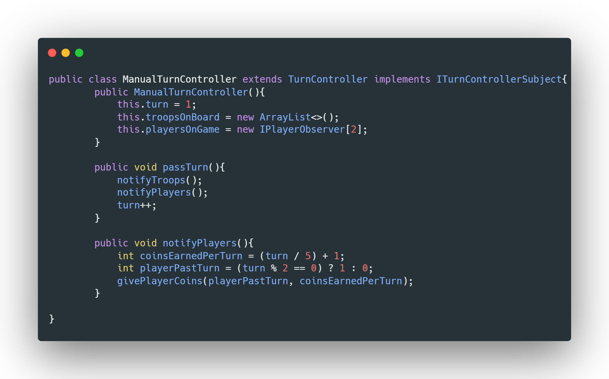
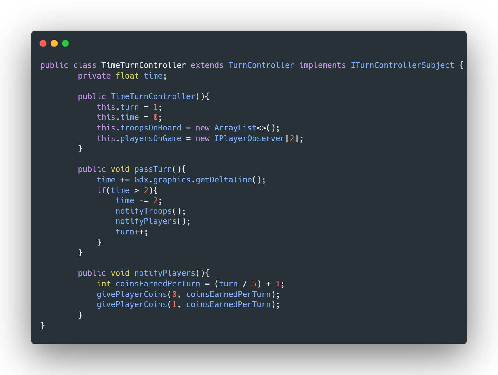

# Pendente

- Destaques de Orientação a Objetos
- Conclusões e Trabalhos Futuros
- Documentação dos Componentes !!!!!

 

---

 

# Projeto `Batalha de Reinos`

# Descrição Resumida do Projeto/Jogo

Batalha de Reinos é um jogo de estratégia com temática de fantasia medieval. No jogo, dois jogadores se enfrentam em um tabuleiro celular de dimensões 4x10. Cada jogador comanda o seu reino e tem a habilidade de treinar tropas de diversos tipos (Soldado, Arqueiro, Cavaleiro, Ladino, Barreira e Mago), que irão seguir até o castelo do adversário enquanto enfrentam suas tropas. O objetivo de cada jogador é coordenar suas tropas no tabuleiro a fim de destruir o castelo de seu oponente.

# Equipe
* `Eduardo Rambauske Pereira Pinto` - `247055`
* `Matheus Gasparotto Lozano` - `247275`

# Arquivo Executável do Jogo

[Arquivo executável (.jar)](./BatalhaDeReinos.jar)

# Slides do Projeto

## Slides da Prévia
[Slides da Prévia do Projeto](./assets/presentation/ApresentaçãoPrévia.pdf)

## Slides da Apresentação Final
[Slides da Apresentação Final](./assets/presentation/Apresenta%C3%A7%C3%A3oFinal.pptx)

## Relatório de Evolução

> Relatório de evolução, descrevendo as evoluções do design do projeto, dificuldades enfrentadas, mudanças de rumo, melhorias e lições aprendidas. Referências aos diagramas e recortes de mudanças são bem-vindos.

1 - Em um primeiro momento, idealizamos o jogo como uma disputa entre dois reinos em que cada jogador teria a sua disposição algumas tropas para enviar ao tabuleiro. 2 - Posteriormente, com objetivo de elevar a complexidade do projeto, decidimos criar itens especiais que alterassem os atributos de tropas específicas afetadas pelo item (as "poções") e, por fim, implementamos diferentes mapas que alterariam atributos de todas as tropas de determinado tipo ou influenciariam a experiência do usuário (os "biomas"). Paralelamente a isso, foram idealizados e implementados diferentes modos de jogo, e também foram criadas diversas telas de menu (menu inicial, menu de configurações, tela de pause).

> 
Primeira versão da tela de jogo.

> 
Versão final da tela de jogo.

Ao longo do desenvolvimento do projeto, uma dificuldade enfrentada foi o domínio do framework utilizado, visto que ele apresenta diversas ferramentas que interagem entre si e que são necessárias para o pleno funcionamento do programa. Por um outro ponto de vista, isso nos propiciou o aprendizado do que são e como funcionam frameworks, além do desenvolvimento da capacidade de criar aplicativos com interface gráfica.

Outro problema com o qual nos deparamos e que vale a penas ser mencionado foi o uso excessivo de memória, pois, para fazermos a alteração da textura de fundo da tela do jogo e da tela de pause quando era mudado o bioma, eram instanciadas duas novas texturas a cada renderização (a uma taxa de 60 fps), o que consumia toda a RAM em menos de um minuto e fazia o computador "crashar". Para solucionar isso, passamos a instanciar cada textura no momento em que a própria tela era instanciada, e alternávamos apenas entre texturas já instanciadas a cada troca de mapa. Tal obstáculo foi importante porque nos mostrou a importância de prestar atenção ao gerenciamento de memória no nosso programa, visto que foi a primeira vez em que falhas desse tipo teriam consequências reais e severas, além de reforçar a importância de um bom planejamento antes do início da criação do código.

# Destaques de Código
# Destaques de Orientação a Objetos

# Encapsulamento
## Diagrama de Classes:
> Sugere-se um diagrama de classes para o destaque, mas podem ser usados outros tipos de diagrama, conforme a necessidade.

## Código do Destaque:

# Polimorfismo
## Diagrama de Classes:

## Código do Destaque:

# Sobrecarga de Métodos
## Diagrama de Classes:

## Código do Destaque:

# Destaques de Pattern

# Uso do Pattern Mediator

## Diagrama do Pattern
> 
## Código do Pattern
> 

> O Pattern Mediator é usado no GameScreenMediator, que guarda e instancia as screens do jogo e utiliza o método setScreen() da classe Game do framework LibGDX quando uma certa Screen é requisitada na camada View. Caso seja solicitado um novo jogo, ele instancia também o GameFacade requerido pela GameScreen, passando para o construtor o modo de jogo correto selecionado pelo usuário.

# Uso do Pattern Facade
## Diagrama do Pattern
> 
## Código do Pattern
> 
> 

> O GameFacade utiliza o Pattern Facade para juntar os controllers utilizados durante a tela de jogo para atualizar o tabuleiro e cria métodos mais sucintos que serão utilizados na GameScreen na camada View.

# Uso dos Pattern Observer e Strategy
## Diagrama do Pattern
> 
## Código do Pattern
> 
> 
> 

> Para atualizar tropas e atributos do jogador durante o jogo, utilizamos o Pattern Observer, em que as tropas e os players seriam notificados ao passar de turno. Para criar diferentes modos de jogo, nós transformamos o TurnController (que seria o Subject dos Observers Players e Troops) em um Strategy, em que os turnos seriam passados e o dinheiro dos jogadores atualizado de forma diferente dependendo do modo selecionado.

# Conclusões e Trabalhos Futuros

> Apresente aqui as conclusões do projeto e propostas de trabalho futuro. Esta é a oportunidade em que você pode indicar melhorias no projeto a partir de lições aprendidas e conhecimentos adquiridos durante a realização do projeto, mas que não puderam ser implementadas por questões de tempo. Por exemplo, há design patterns aprendidos no final do curso que provavelmente não puderam ser implementados no jogo -- este é o espaço onde você pode apresentar como aplicaria o pattern no futuro para melhorar o jogo.

Com a finalização do projeto pudemos concluir o impacto positivo de um bom planejamento de arquitetura de software, o que nos facilitou a escrita de um código mais compreensível, modular e de fácil expansão.

Para melhorias no jogo temos a criação de novos modos, como de 1 jogador contra a máquina e 2 jogadores online, além de um modo por tempo, em que o resultado do jogo seria definido por uma pontuação definida por tropas inimigas abatidas. Correção de eventuais bugs.

# Documentação dos Componentes

# Diagramas

## Diagrama Geral da Arquitetura do Jogo

> 

> A estrutura da arquitetura do nosso projeto seguiu o modelo MVC e para fazer o nosso jogo utilizamos o framework LibGDX, responsável por abrir a janela e pela renderização gráfica. O programa inicia pela classe principal BatalhaDeReinos e começa a aplicação instanciando o GameScreenMediator, que é principalmente usado para a troca de telas no jogo. No caso da GameScreen, o GameScreenMediator também instanciará e passará o GameFacade, que reúne os controllers do jogo. Além disso, para se comunicar com o model de um Board (que é instanciado e conectado ao GameFacade na camada View), temos principalmente os observers dos players e dos jogadores conectados com o subject, que seria o controlador dos turnos.

## Diagrama Geral de Componentes

### Screen e Screen Mediator

Este é o diagrama compondo componentes para análise:

### Game Controllers com Game Screen e Turn Controller

Este é um diagrama inicial do projeto de jogos:

### Turn Controller com Observers Troop e Player

Este é outro diagrama de um projeto de vendas:

Para cada componente será apresentado um documento conforme o modelo a seguir:

## Componente `Player`

> Resumo do papel do componente e serviços que ele oferece.

**Ficha Técnica**
item | detalhamento
----- | -----
Classe | `<caminho completo da classe com pacotes>`   Exemplo: `pt.c08componentes.s20catalog.s10ds.DataSetComponent`
Autores | `<nome dos membros que criaram o componente>`
Interfaces | `<listagem das interfaces do componente>`

### Interfaces

Interfaces associadas a esse componente:

Interface agregadora do componente em Java:

~~~java
public interface IDataSet extends ITableProducer, IDataSetProperties {
}
~~~

## Detalhamento das Interfaces

### Interface `<nome da interface>`

`<Resumo do papel da interface.>`

~~~
<Interface em Java.>
~~~

Método | Objetivo
-------| --------
`<id do método em Java>` | `<objetivo do método e descrição dos parâmetros>`

## Exemplo:

### Interface `ITableProducer`

Interface provida por qualquer fonte de dados que os forneça na forma de uma tabela.

~~~java
public interface ITableProducer {
  String[] requestAttributes();
  String[][] requestInstances();
}
~~~

Método | Objetivo
-------| --------
`requestAttributes` | Retorna um vetor com o nome de todos os atributos (colunas) da tabela.
`requestInstances` | Retorna uma matriz em que cada linha representa uma instância e cada coluna o valor do respectivo atributo (a ordem dos atributos é a mesma daquela fornecida por `requestAttributes`.

### Interface `IDataSetProperties`

Define o recurso (usualmente o caminho para um arquivo em disco) que é a fonte de dados.

~~~java
public interface IDataSetProperties {
  public String getDataSource();
  public void setDataSource(String dataSource);
}
~~~

Método | Objetivo
-------| --------
`getDataSource` | Retorna o caminho da fonte de dados.
`setDataSource` | Define o caminho da fonte de dados, informado através do parâmetro `dataSource`.

## Componente `Troop`

## Componente `TurnController`

## Componente `GameControllers`

## Componente `GameScreenMediator`

## Componente `GameScreen`

## Componente `MenuScreens`

# Plano de Exceções

## Diagrama da hierarquia de exceções

## Descrição das classes de exceção

Classe | Descrição
----- | -----
ComandoInvalido | Engloba todas as exceções de comandos inválidos.
EntradaInvalida | Engloba exceções de entradas inválidas do usuário.
ClicadoEmPosicaoInvalida | Indica que o jogador clicou em uma posição inválida para colocar a tropa.
ComandoPressionadoInvalido | Indica que o jogador pressionou uma tecla inválida.
TreinamentoInvalido | Engloba exceções de treinamento inválido de tropas.
TreinamentoSemDinheiro | Indica que o jogador não tem dinheiro suficiente para treinar a tropa.
TreinamentoEmCasaCheia | Indica que a casa em que o jogador tentou treinar a tropa já está ocupada.

> Observação: embora tenhamos esquematizado o Plano de Exceções, no código não foi implementada nenhuma das classes de exceção acima, pois todos os eventos mencionados foram tratados ou por ferramentas do framework LibGDX ou pela forma como estruturamos o fluxo do jogo.
