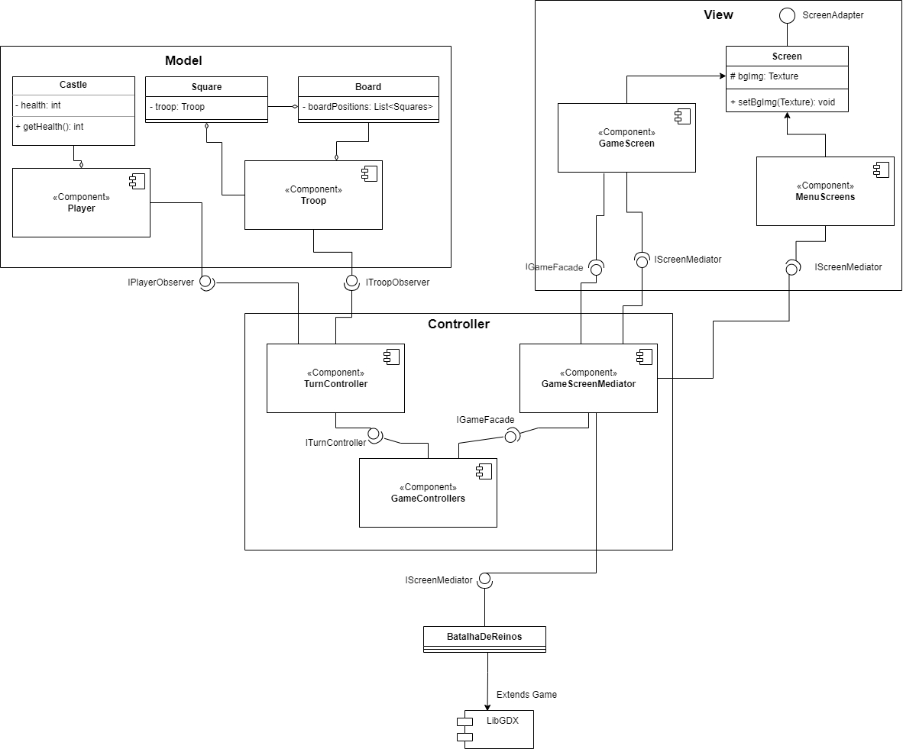

# Projeto Batalha de Reinos

# Descrição Resumida do Projeto/Jogo

Batalha de Reinos é um jogo de estratégia com temática de fantasia medieval. No jogo, dois jogadores se enfrentam em um tabuleiro celular de dimensões 4x10. Cada jogador comanda o seu reino e tem a habilidade de treinar tropas de diversos tipos (Soldado, Arqueiro, Cavaleiro, Ladino, Barreira e Mago), que irão seguir até o castelo do adversário enquanto enfrentam suas tropas. O objetivo de cada jogador é coordenar suas tropas no tabuleiro a fim de destruir o castelo de seu oponente.

# Equipe
* Eduardo Rambauske Pereira Pinto - 247055
* Matheus Gasparotto Lozano - 247275

# Arquivo Executável do Jogo

[Dowload do arquivo executável (.jar)](https://drive.google.com/file/d/1eo8QWTW9PkHHHEahToCbaQsBAw5LndnB/view?ts=62ba7d62)

# Slides do Projeto

## Slides da Prévia
[Slides da Prévia do Projeto](assets/presentation/ApresentaçãoPrévia.pdf)

## Slides da Apresentação Final
[Slides da Apresentação Final](assets/presentation/Apresenta%C3%A7%C3%A3oFinal.pptx)

# Diagramas

## Diagrama Geral da Arquitetura do Jogo

