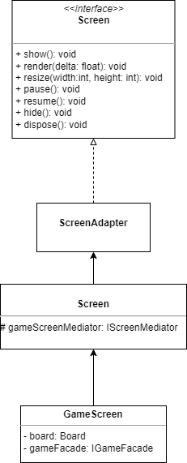

# Projeto `Batalha de Reinos`

# Descrição Resumida do Projeto/Jogo

Batalha de Reinos é um jogo de estratégia com temática de fantasia medieval. No jogo, dois jogadores se enfrentam em um tabuleiro celular de dimensões 4x10. Cada jogador comanda o seu reino e tem a habilidade de treinar tropas de diversos tipos (Soldado, Arqueiro, Cavaleiro, Ladino, Barreira e Mago), que irão seguir até o castelo do adversário enquanto enfrentam suas tropas. O objetivo de cada jogador é coordenar suas tropas no tabuleiro a fim de destruir o castelo de seu oponente.

# Equipe
* `Eduardo Rambauske Pereira Pinto` - `247055`
* `Matheus Gasparotto Lozano` - `247275`

# Arquivo Executável do Jogo

[Arquivo executável (.jar)](./BatalhaDeReinos.jar)

# Slides do Projeto

## Slides da Prévia
[Slides da Prévia do Projeto](./assets/presentation/ApresentaçãoPrévia.pdf)

## Slides da Apresentação Final
[Slides da Apresentação Final](./assets/presentation/Apresenta%C3%A7%C3%A3oFinal.pptx)

## Relatório de Evolução

Em um primeiro momento, idealizamos o jogo como uma disputa entre dois reinos em que cada jogador teria a sua disposição algumas tropas para enviar ao tabuleiro. Posteriormente, com objetivo de elevar a complexidade do projeto, decidimos criar itens especiais que alterassem os atributos de tropas específicas afetadas pelo item (as "poções") e, por fim, implementamos diferentes mapas que alterariam atributos de todas as tropas de determinado tipo ou influenciariam a experiência do usuário (os "biomas"). Paralelamente a isso, foram idealizados e implementados diferentes modos de jogo, e também foram criadas diversas telas de menu (menu inicial, menu de configurações, tela de pause).

> 
 Primeira versão da tela de jogo.

> 
 Versão final da tela de jogo.

Ao longo do desenvolvimento do projeto, uma dificuldade enfrentada foi o domínio do framework utilizado, visto que ele apresenta diversas ferramentas que interagem entre si e que são necessárias para o pleno funcionamento do programa. Por um outro ponto de vista, isso nos propiciou o aprendizado do que são e como funcionam frameworks, além do desenvolvimento da capacidade de criar aplicativos com interface gráfica.

Outro problema com o qual nos deparamos e que vale a penas ser mencionado foi o uso excessivo de memória, pois, para fazermos a alteração da textura de fundo da tela do jogo e da tela de pause quando era mudado o bioma, eram instanciadas duas novas texturas a cada renderização (a uma taxa de 60 fps), o que consumia toda a RAM em menos de um minuto e fazia o computador "crashar". Para solucionar isso, passamos a instanciar cada textura no momento em que a própria tela era instanciada, e alternávamos apenas entre texturas já instanciadas a cada troca de mapa. Tal obstáculo foi importante porque nos mostrou a importância de prestar atenção ao gerenciamento de memória no nosso programa, visto que foi a primeira vez em que falhas desse tipo teriam consequências reais e severas, além de reforçar a importância de um bom planejamento antes do início da criação do código.

# Destaques de Código
# Destaques de Orientação a Objetos

# Encapsulamento e Extensão de Métodos
## Diagrama de Classes:

> Note que o diagrama UML não apresenta todos os atributos e métodos definidos em cada classe apresentada, e sim apenas os necessários para entendimento do destaque.

## Código do Destaque:

~~~java
public abstract class Screen extends ScreenAdapter {
    protected final BatalhaDeReinos game;
    protected IScreenMediator gameScreenMediator;
	protected SpriteBatch batch;
	protected BitmapFont font;
	protected OrthographicCamera camera;
    protected Stage stage;

    protected Texture bgImg;
    protected ArrayList<MyButton> buttons;

    /* ... */

    @Override
    public void show() {
        Gdx.input.setInputProcessor(stage);
    }

    @Override
    public void render(float delta) {
        Gdx.gl.glClear(GL20.GL_COLOR_BUFFER_BIT);
        camera.update();
        batch.setProjectionMatrix(camera.combined);

        batch.begin();
        batch.draw(bgImg, 0, 0);
		batch.end();

        stage.draw();
        
        /* ... */
    }

    /* ... */
}
~~~

~~~java
public class MainMenuScreen extends Screen{
	/* ... */

	public void show() {
		super.show();

		setBackgroundImage(...);

		createButton(...);
		createButton(...);
		createButton(...);
	}
}
~~~

~~~java
public class GameScreen extends Screen{
	/* ... */

	public void render(float delta) {
        super.render(delta);

        time += Gdx.graphics.getDeltaTime();
        timer.update(...);

        /* ... */

        life1.update(...);
        coins1.update(...);
        
        /* ... */

        drawBoardFromModel();
        
        /* ... */
    }

    /* ... */
}
~~~

Um destaque de encapsulamento foi a classe abstrata pt.projeto.batalhadereinos.view.Screen, cujos atributos apresentam o nível de acesso protegido para que possam ser acessados pelas classes herdeiras (que definem as diferentes telas do jogo).

Além disso, a classe abstrata também implementa os métodos show e render, implementando apenas o mínimo necessário para funcionamento correto do programa. Note, no diagrama, que as classes MainMenuScreen e SettingsScreen estendem apenas o método show, enquanto a classe GameScreen estende também o método render. Isso ocorre porque as duas primeiras telas são apenas menus com botões, ou seja, são telas "estáticas" (é necessário apenas definir os botões e seu comportamento), enquanto a última é "dinâmica", ou seja, há elementos que se movem / alteram seu valor ao longo da execução, logo é necessário estender também o método render, como é mostrado no código de destaque.

# Polimorfismo
## Diagrama de Classes:

> 
  Diagrama de herança dos controladores de turno.

> 
  Diagrama de herança das tropas.

> 
  Diagrama de herança das telas.

## Código do Destaque:

~~~java
public class GameFacade implements IGameFacade {
    private ITurnControllerSubject turnController;
    /* ... */

    public void determineTurnController() {
        if (gameMode.equals("time")) {
            this.turnController = new TimeTurnController();
        } else if (gameMode.equals("time2")) {
            this.turnController = new InsaneTimeTurnController();
        } else {
            this.turnController = new ManualTurnController();
        }
    }

    public int getTurn() {
        return turnController.getTurn();
    }

    public void passTurn() {
        turnController.passTurn();
    }

    /* ... */
}
~~~

~~~java
public abstract class TurnController {
    /* ... */
    protected ArrayList<ITroopObserver> troopsOnBoard;
    
    /* ... */

    public void subscribeTroop(ITroopObserver troop){
        troopsOnBoard.add(troop);
    }

    public void unsubscribeTroop(ITroopObserver troop){
        troopsOnBoard.remove(troop);
    }

    /* ... */
}
~~~

~~~java
public class GameScreenMediator implements IScreenMediator{
    private BatalhaDeReinos game;
    private MainMenuScreen mainMenuScreen;
    private SettingsScreen settingsScreen;
    private GameScreen gameScreen;
    private CreditScreen creditScreen;
    private PauseScreen pauseScreen;
    private HowToPlayScreen howToPlayScreen;
    private EndScreen endScreen;

    public GameScreenMediator(BatalhaDeReinos game){
        this.game = game;
        this.mainMenuScreen = new MainMenuScreen(game,this);
        this.settingsScreen = new SettingsScreen(game,this);
        this.creditScreen = new CreditScreen(game,this);
        this.howToPlayScreen = new HowToPlayScreen(game,this);
    }

    public void changeScreen(String screen){
        /* ... */

        switch(screen){
            case "MainMenu":
                game.setScreen(mainMenuScreen);
                break;
            case "Settings":
                game.setScreen(settingsScreen);
                break;
            /* ... */
        }
    }
}
~~~

Utilizamos polimorfismo em três situações: para o controle de turnos, para as tropas e para as telas do jogo.

No primeiro caso, foi criada a classe abstrata pt.projeto.batalhadereinos.controller.TurnController. Como visto no primeiro código de destaque, é explorado o polimorfismo dos controladores de turno no GameFacade, que apresenta um atributo declarado em ITurnControllerSubject, de modo que pode armazenar objetos instanciados em qualquer tipo de TurnController sem distinção, facilitando a expansão do programa com criação de novos modos de jogo.

No segundo caso, foi criada a classe abstrata pt.projeto.batalhadereinos.model.Troop. Como visto no segundo código de destaque de código, é explorado o polimorfismo em uma ArrayList declarada em ITroopObserver na classe abstrata TurnController, de modo que a estrutura de dados possa armazenar qualquer tipo de tropa sem realizar distinção entre elas.

No terceiro caso, foi criada a classe abstrata pt.projeto.batalhadereinos.view.Screen, e cada diferente tela é definida em uma classe herdeira de Screen. O polimorfismo é explorado ao alternar entre diferentes telas na classe GameScreenMediator, como visto no terceiro código de destaque. Isso é feito por meio do método Game.setScreen (definido pelo próprio framework), que recebe um parâmetro declarado na interface Screen (também parte do framework), e permite a alternância entre diferentes telas com maior facilidade e propicia expansão com criação de novas telas (como menus etc.).

# Sobrecarga de Métodos

## Diagrama de Classes:

> Note que o diagrama UML não apresenta todos os atributos e métodos definidos na classe apresentada, e sim apenas o necessário para entendimento do destaque.

## Código do Destaque:

~~~java
public abstract class Screen extends ScreenAdapter {
    /* ... */

    public void setBackgroundImage(String path) {
        this.bgImg = new Texture(Gdx.files.internal(path));
    }

    public void setBackgroundImage(Texture texture) {
        this.bgImg = texture;
    }

    public MyButton createButton(String path, float x, float y, final IButtonCommand buttonCommand) {
        ImageButtonStyle buttonStyle = MyButton.generateStyle(path);
        return this.createButton(buttonStyle, x, y, buttonCommand);
    }

    public MyButton createButton(ImageButtonStyle buttonStyle, float x, float y, final IButtonCommand buttonCommand) {
        MyButton newButton = new MyButton(buttonStyle, x, y, buttonCommand);
        stage.addActor(newButton);
        buttons.add(newButton);
        return newButton;
    }

    /* ... */
}
~~~

Na classe pt.projeto.batalhadereinos.view.Screen, utilizamos sobrecarga de métodos para que os métodos em questão aceitassem dois tipos diferentes de argumento, versatilizando o uso sem necessidade de implementação de um método completamente novo.

Em ambos casos, o método foi sobrecarregado para que aceitasse tanto uma String contendo o caminho para um arquivo de imagem quando a textura já renderizada. Caso for chamada a primeira versão, o método instanciará a textura a partir do arquivo fornecido e chamará a outra versão do método para realizar o devido procedimento.

# Destaques de Pattern

# Uso do Pattern Mediator

## Diagrama do Pattern

## Código do Pattern

~~~java
public class GameScreenMediator implements IScreenMediator{
    private BatalhaDeReinos game;
    private MainMenuScreen mainMenuScreen;
    private SettingsScreen settingsScreen;
    private GameScreen gameScreen;
    private CreditScreen creditScreen;
    private PauseScreen pauseScreen;
    private HowToPlayScreen howToPlayScreen;
    private EndScreen endScreen;

    public GameScreenMediator(BatalhaDeReinos game){
        this.game = game;
        this.mainMenuScreen = new MainMenuScreen(game,this);
        this.settingsScreen = new SettingsScreen(game,this);
        this.creditScreen = new CreditScreen(game,this);
        this.howToPlayScreen = new HowToPlayScreen(game,this);
    }

    public void changeScreen(String screen){

        IGameFacade gameFacade;

        switch(screen){
            case "MainMenu":
                game.setScreen(mainMenuScreen);
                break;
            case "Settings":
                game.setScreen(settingsScreen);
                break;
            /* ... */
        }
    }
}
~~~

O Pattern Mediator é usado no GameScreenMediator, que guarda e instancia as screens do jogo e utiliza o método setScreen da classe Game do framework LibGDX quando uma certa Screen é requisitada na camada View. Caso seja solicitado um novo jogo, ele instancia também o GameFacade requerido pela GameScreen, passando para o construtor o modo de jogo correto selecionado pelo usuário.

# Uso do Pattern Facade

## Diagrama do Pattern

> 

## Código do Pattern

~~~java
public class GameFacade implements IGameFacade{
    private ITurnControllerSubject turnController;
    private TroopCreatorController troopCreatorController;
    private PlayerController playerController;
    private BuffGeneratorController buffGeneratorController;
    private MapChangerController mapChangerController;
    private Board board;
    private String gameMode;

    public GameFacade(String gameMode){
        this.gameMode = gameMode;
        determineTurnController();
    }

    /* ... */
}
~~~

~~~java
public class GameScreen extends Screen {

    private IGameFacade gameFacade;

    public GameScreen(final BatalhaDeReinos game, IGameFacade gameFacade, IScreenMediator gameScreenMediator, PauseScreen pauseScreen, EndScreen endScreen) {
        super(game, gameScreenMediator);
        this.gameFacade = gameFacade;
        /* ... */
    }

    /* ... */
}
~~~

O GameFacade utiliza o Pattern Facade para juntar os controllers utilizados durante a tela de jogo para atualizar o tabuleiro e cria métodos mais sucintos que serão utilizados na GameScreen na camada View.

# Uso dos Pattern Observer e Strategy

## Diagrama do Pattern

> 

## Código do Pattern

~~~java
public abstract class TurnController {
    protected int turn;
    protected ArrayList<ITroopObserver> troopsOnBoard;
    protected IPlayerObserver[] playersOnGame;

    /* ... */

    public void subscribeTroop(ITroopObserver troop){
        troopsOnBoard.add(troop);
    }

    /* ... */

    public void subscribePlayers(IPlayerObserver player1, IPlayerObserver player2){
        playersOnGame[0] = player1;
        playersOnGame[1] = player2;
    }

    public void notifyTroops(){
        TreeMap<Integer,ArrayList<ITroopObserver>> atacantesTreeMap = new TreeMap<>(Collections.reverseOrder());
        /* ...*/
    }

    /* ... */
}
~~~

~~~java
public class ManualTurnController extends TurnController implements ITurnControllerSubject{
        public ManualTurnController(){
            this.turn = 1;
            this.troopsOnBoard = new ArrayList<>();
            this.playersOnGame = new IPlayerObserver[2];
        }

        public void passTurn(){
            notifyTroops();
            notifyPlayers();
            turn++;
        }

        public void notifyPlayers(){
            int coinsEarnedPerTurn = (turn / 5) + 1;
            int playerPastTurn = (turn % 2 == 0) ? 1 : 0;
            givePlayerCoins(playerPastTurn, coinsEarnedPerTurn);
        }
}
~~~

~~~java
public class TimeTurnController extends TurnController implements ITurnControllerSubject {
        private float time;

        public TimeTurnController(){
            this.turn = 1;
            this.time = 0;
            this.troopsOnBoard = new ArrayList<>();
            this.playersOnGame = new IPlayerObserver[2];
        }

        public void passTurn(){
            time += Gdx.graphics.getDeltaTime();
            if(time > 2){
                time -= 2;
                notifyTroops();
                notifyPlayers();
                turn++;
            }
        }

        public void notifyPlayers(){
            int coinsEarnedPerTurn = (turn / 5) + 1;
            givePlayerCoins(0, coinsEarnedPerTurn);
            givePlayerCoins(1, coinsEarnedPerTurn);
        }
}
~~~

Para atualizar tropas e atributos do jogador durante o jogo, utilizamos o Pattern Observer, em que as tropas e os players seriam notificados ao passar de turno. Para criar diferentes modos de jogo, nós transformamos o TurnController (que seria o Subject dos Observers Players e Troops) em um Strategy, em que os turnos seriam passados e o dinheiro dos jogadores atualizado de forma diferente dependendo do modo selecionado.

# Conclusões e Trabalhos Futuros

Com a finalização do projeto pudemos concluir o impacto positivo de um bom planejamento de arquitetura de software e conceitos de programação orientada a objetos, o que nos facilitou a escrita de um código mais compreensível, modular e de fácil expansão.

Para melhorias no jogo, temos a intenção de criar novos modos de jogo, como jogador versus máquina (singleplayer) e jogador versus jogador online (multiplayer), além de um modo por tempo, em que o vencedor do jogo seria definido por uma pontuação obtida ao abater tropas inimigas. Também visamos adicionar animações de dano e morte às tropas e pretendemos melhorar o sistema de feedback de comandos ao usuário (por exemplo, o número de moedas piscar em vermelho quando não há dinheiro suficiente para colocar determinada tropa), o que pode ser feito por meio da implementação de classes de exceção. Por fim, é desejável a correção de eventuais bugs que não tenham sido detectados ao longo do desenvolvimento.

# Documentação dos Componentes

# Diagramas

## Diagrama Geral da Arquitetura do Jogo

> 

A estrutura da arquitetura do nosso projeto seguiu o modelo MVC e para fazer o nosso jogo utilizamos o framework LibGDX, responsável por abrir a janela e pela renderização gráfica. O programa inicia pela classe principal BatalhaDeReinos e começa a aplicação instanciando o GameScreenMediator, que é principalmente usado para a troca de telas no jogo. No caso da GameScreen, o GameScreenMediator também instanciará e passará o GameFacade, que reúne os controllers do jogo. Além disso, para se comunicar com o model de um Board (que é instanciado e conectado ao GameFacade na camada View), temos principalmente os observers dos players e dos jogadores conectados com o subject, que seria o controlador dos turnos.

## Diagrama Geral de Componentes

## Componente `Player`

> Componente da camada Model que guarda a informação dos 2 jogadores e implementa a interface ITroopObserver, que é requerida pelo seu Subject (componente TurnController).

**Ficha Técnica**
item | detalhamento
----- | -----
Classe |  `pt.projeto.batalhadereinos.model.Player`
Autores | `Eduardo Rambauske Pereira Pinto e Matheus Gasparotto Lozano`
Interfaces | `IPlayerObserver`

### Interfaces

Interfaces associadas a esse componente:

## Detalhamento das Interfaces

### Interface `IPlayerObserver`

`Interface do Player como Observer, que define o método de receber moedas que podem ser chamados a partir da notificação de um Subject.`

~~~java
public interface IPlayerObserver {
    public void gainCoins(int num);
}
~~~

Método | Objetivo
-------| --------
`gainCoins` | `Recebe um inteiro e soma esse valor ao número de moedas de um jogador a partir do TurnController.`

## Componente `Troop`

> Componente da camada Model que guarda a informação das tropas do jogo e implementa a interface ITroopObserver, que é requerida pelo seu Subject (componente TurnController).

**Ficha Técnica**
item | detalhamento
----- | -----
Classe |  `pt.projeto.batalhadereinos.model.Troop`
Autores | `Eduardo Rambauske Pereira Pinto e Matheus Gasparotto Lozano`
Interfaces | `ITroopObserver`

### Interfaces

Interfaces associadas a esse componente:

## Detalhamento das Interfaces

### Interface `ITroopObserver`

`Interface de tropas como Observer, que define os método de para se mover, atacar e verificar o mapa, que podem ser chamados a partir da notificação de um Subject.`

~~~java
public interface ITroopObserver {
    public boolean move();
    public void attack();
    public void verifyMap();
}
~~~

Método | Objetivo
-------| --------
`move` | `Move a tropa no tabuleiro.`
`attack` | `Faz a tropa atacar tropas inimigas no alcance.`
`verifyMap` | `Faz a tropa verificar as condições do mapa (biomas) para alterar seus atributos.`

## Componente `TurnController`

> Componente responsável por manter e atualizar o estado de tropas e jogadores no jogo de acordo com a passagem de turnos. Esse componente implementa a interface ITurnControllerSubject, que é passada para o GameFacade, e é marcado pela aplicação do pattern Observer,  de modo que, quando uma mudança é realizada, realiza mudanças nos observers (as interfaces IPlayerObserver e ITroopObserver, que são requeridas).

**Ficha Técnica**
item | detalhamento
----- | -----
Classe |  `pt.projeto.batalhadereinos.controller.TurnController`
Autores | `Eduardo Rambauske Pereira Pinto e Matheus Gasparotto Lozano`
Interfaces | `ITurnControllerSubject`

### Interfaces

Interfaces associadas a esse componente:

## Detalhamento das Interfaces

### Interface `ITurnControllerSubject`

`Interface que define o controller responsável pela passagem de turnos. Além disso, possui métodos como Subject para guardar assinatura e notificar Players Observers e Troop Observers.`

~~~java
public interface ITurnControllerSubject {
    public void subscribeTroop(ITroopObserver troop);
    public void unsubscribeTroop(ITroopObserver troop);
    public void subscribePlayers(IPlayerObserver player1, IPlayerObserver player2);
    public void notifyTroops();
    public void notifyPlayers();
    public void passTurn();
    public int getTurn();
}
~~~

Método | Objetivo
-------| --------
`subscribeTroop` | `Inscreve um TroopObserver no TurnController.`
`unsubscribeTroop` | `Remove inscrição de um Troop Observer no TurnController.`
`subscribePlayers` | `Inscreve 2 Players Observers no TurnController.`
`notifyTroops` | `Notifica os Troop Observers inscritos para realizarem movimentação e ataque.`
`notifyPlayers` | `Notifica os Players Observers inscritos ganharem moedas.`
`passTurn` | `Passa o turno e realiza as notificações.`
`getTurn` | `Retorna o turno atual do jogo.`

## Componente `GameControllers`

> Componente responsável por reunir controllers utilizados para alterações no model e passar eles para a camada View de forma mais fácil a partir do Pattern Facade e interface IGameFacade. Também requere a interface do controller ITurnControllerSubject.

**Ficha Técnica**
item | detalhamento
----- | -----
Classe |  `pt.projeto.batalhadereinos.controller.GameFacade`
Autores | `Eduardo Rambauske Pereira Pinto e Matheus Gasparotto Lozano`
Interfaces | `IGameFacade`

### Interfaces

Interfaces associadas a esse componente:

## Detalhamento das Interfaces

### Interface `IGameFacade`

`Interface que define métodos do GameFacade, o qual implementa o pattern Facade, reunindo os controllers usados durante o jogo de forma a gerar comandos mais intuitivos para serem usados na camada View pela GameScreen.`

~~~java
public interface IGameFacade {
    public void setBoard(Board board);
    public String getGameMode();
    public String getMap();
    public int getTurn();
    public void passTurn();
    public void tryGenerateBuff();
    public void tryChangeMap();
    public int getCurrentPlayer();
    public String getPlayerName(int num);
    public int getCastleHealth(int num);
    public int getPlayerCoins(int num);
    public void selectTroop(String troop, int numberOfPlayer);
    public String getSelectedTroop(int numberOfPlayer);
    public void dynamicPlaceTroop(int row, int column, int currentPlayer);
    public void turnPlaceTroop(int row, int column);
    public Troop getTroopFromSquare(int row, int column);
    public Buff getBuffFromSquare(int row, int column);
    public boolean getFireFromSquare(int row, int column);
    public boolean checkEndGame();
    public String getVencedor();
}
~~~

Método | Objetivo
-------| --------
`setBoard` | `Recebe o board criado na GameScreen para controllers que necessitam do board no construtor.`
`getGameMode` | `Retorna String do modo de jogo atual da GameScreen.`
`getMap` | `Retorna String do mapa(bioma) atual do board da GameScreen.`
`getTurn` | `Retorna inteiro do turno atual do jogo.`
`passTurn` | `Passa o turno do jogo.`
`tryGenerateBuff` | `Verifica a geração de Buffs(Poções) e se possível gera eles.`
`tryChangeMap` | `Verifica se está no turno para trocar de mapa e troca aleatoriamente para um dos mapas possíveis.`
`getCurrentPlayer` | `Retorna o inteiro do número do jogador do turno atual.`
`getPlayerName` | `Recebe o número de um jogador e retorna String do nome desse jogador.`
`getCastleHealth` | `Recebe o número de um jogador e retorna inteiro da vida do castelo desse jogador.`
`getPlayerCoins` | `Recebe o número de um jogador e retorna o inteiro do número de moedas desse jogador.`
`selectTroop` | `Recebe a String de uma tropa e o inteiro do número de um jogador e faz esse jogador ter essa tropa selecionada para colocar no tabuleiro.`
`getSelectedTroop` | `Recebe o inteiro do número de um jogador e retorna String dessa tropa.`
`dynamicPlaceTroop` | `Usado para colocar tropas no modo dinâmico recebe inteiros de linha e coluna onde a tropa selecionada será colocada e numero do jogador com tropa selecionada.`
`turnPlaceTroop` | `Usado para colocar tropas no modo em turnos recebe inteiros de linha e coluna onde tropa do jogador do turno atual colocará a tropa.`
`getTroopFromSquare` | `Recebe inteiros de linha e coluna de uma casa do tabuleiro e retorna tropa presente nessa casa do tabuleiro.`
`getBuffFromSquare` | `Recebe inteiros de linha e coluna de uma casa do tabuleiro e retorna buff(poção) presente nessa casa do tabuleiro.`
`getFireFromSquare` | `Recebe inteiros de linha e coluna de uma casa do tabuleiro e retorna buff(poção) presente nessa casa do tabuleiro.`
`checkEndGame` | `Verifica se o jogo acabou.`
`getVencedor` | `Retorna String do nome do jogador vencedor do jogo.`

## Componente `GameScreenMediator`

> Componente responsável pela troca de telas durante o jogo e manutenção do fluxo do jogo. Implementa a interface IScreenMediator e requere a interface IGameFacade, que será passada para o componente GameScreen quando o usuário solicitar o início de um novo jogo. 

**Ficha Técnica**
item | detalhamento
----- | -----
Classe |  `pt.projeto.batalhadereinos.controller.GameScreenMediator`
Autores | `Eduardo Rambauske Pereira Pinto e Matheus Gasparotto Lozano`
Interfaces | `IScreenMediator`

### Interfaces

Interfaces associadas a esse componente:

## Detalhamento das Interfaces

### Interface `IGameFacade`

`Interface que define métodos do GameFacade, o qual implementa o pattern Facade, reunindo os controllers usados durante o jogo de forma a gerar comandos mais intuitivos para serem usados na camada View pela GameScreen.`

~~~java
public interface IGameFacade {
    public void setBoard(Board board);
    public String getGameMode();
    public String getMap();
    public int getTurn();
    public void passTurn();
    public void tryGenerateBuff();
    public void tryChangeMap();
    public int getCurrentPlayer();
    public String getPlayerName(int num);
    public int getCastleHealth(int num);
    public int getPlayerCoins(int num);
    public void selectTroop(String troop, int numberOfPlayer);
    public String getSelectedTroop(int numberOfPlayer);
    public void dynamicPlaceTroop(int row, int column, int currentPlayer);
    public void turnPlaceTroop(int row, int column);
    public Troop getTroopFromSquare(int row, int column);
    public Buff getBuffFromSquare(int row, int column);
    public boolean getFireFromSquare(int row, int column);
    public boolean checkEndGame();
    public String getVencedor();
}
~~~

Método | Objetivo
-------| --------
`setBoard` | `Recebe o board criado na GameScreen para controllers que necessitam do board no construtor.`
`getGameMode` | `Retorna String do modo de jogo atual da GameScreen.`
`getMap` | `Retorna String do mapa(bioma) atual do board da GameScreen.`
`getTurn` | `Retorna inteiro do turno atual do jogo.`
`passTurn` | `Passa o turno do jogo.`
`tryGenerateBuff` | `Verifica a geração de Buffs(Poções) e se possível gera eles.`
`tryChangeMap` | `Verifica se está no turno para trocar de mapa e troca aleatoriamente para um dos mapas possíveis.`
`getCurrentPlayer` | `Retorna o inteiro do número do jogador do turno atual.`
`getPlayerName` | `Recebe o número de um jogador e retorna String do nome desse jogador.`
`getCastleHealth` | `Recebe o número de um jogador e retorna inteiro da vida do castelo desse jogador.`
`getPlayerCoins` | `Recebe o número de um jogador e retorna o inteiro do número de moedas desse jogador.`
`selectTroop` | `Recebe a String de uma tropa e o inteiro do número de um jogador e faz esse jogador ter essa tropa selecionada para colocar no tabuleiro.`
`getSelectedTroop` | `Recebe o inteiro do número de um jogador e retorna String dessa tropa.`
`dynamicPlaceTroop` | `Usado para colocar tropas no modo dinâmico recebe inteiros de linha e coluna onde a tropa selecionada será colocada e numero do jogador com tropa selecionada.`
`turnPlaceTroop` | `Usado para colocar tropas no modo em turnos recebe inteiros de linha e coluna onde tropa do jogador do turno atual colocará a tropa.`
`getTroopFromSquare` | `Recebe inteiros de linha e coluna de uma casa do tabuleiro e retorna tropa presente nessa casa do tabuleiro.`
`getBuffFromSquare` | `Recebe inteiros de linha e coluna de uma casa do tabuleiro e retorna buff(poção) presente nessa casa do tabuleiro.`
`getFireFromSquare` | `Recebe inteiros de linha e coluna de uma casa do tabuleiro e retorna buff(poção) presente nessa casa do tabuleiro.`
`checkEndGame` | `Verifica se o jogo acabou.`
`getVencedor` | `Retorna String do nome do jogador vencedor do jogo.`

### Interface `IScreenMediator`

`Interface do GameScreenMediator que define o método de trocar de tela do jogo, que será usado pelas Screens durante o jogo, já que o GameScreenMediator é responsável por guardar as telas do jogo e trocá-las de forma apropriada quando requisitado pela camada View (fazendo com que as Screens não necessitem entrar em contato entre si). `

~~~java
public interface IScreenMediator {
    public void changeScreen(String screen);
}
~~~

Método | Objetivo
-------| --------
`changeScreen` | `Recebe uma String dizendo para qual Screen o jogo deve ser trocado.`

## Componente `GameScreen`

> Componente responsável pelas tela principal do jogo. Implementa a interface Screen do LibGDX para renderização de imagens e requere as interfaces IScreenMediator para troca de telas e IGameFacade para se conectar com a camada Controller realizar atualizações no Model com base nas interações do usuário.

**Ficha Técnica**
item | detalhamento
----- | -----
Classe |  `pt.projeto.batalhadereinos.view.GameScreen`
Autores | `Eduardo Rambauske Pereira Pinto e Matheus Gasparotto Lozano`
Interfaces | `Screen`

### Interfaces

Interfaces associadas a esse componente:

## Detalhamento das Interfaces

### Interface `Screen`

> Interface fornecida pelo Framework LibGDX. Confira o código e documentação em:
 https://github.com/libgdx/libgdx/blob/master/gdx/src/com/badlogic/gdx/Screen.java

## Componente `MenuScreens`

> Componente responsável pelas telas de menu do jogo. Implementa a interface Screen do LibGDX para renderização de imagens e requere a interface IScreenMediator para troca de telas.

**Ficha Técnica**
item | detalhamento
----- | -----
Classe |  `pt.projeto.batalhadereinos.view.MainMenuScreen`
Autores | `Eduardo Rambauske Pereira Pinto e Matheus Gasparotto Lozano`
Interfaces | `Screen`

### Interfaces

Interfaces associadas a esse componente:

## Detalhamento das Interfaces

### Interface `Screen`

> Interface fornecida pelo Framework LibGDX. Confira o código e documentação em:
 https://github.com/libgdx/libgdx/blob/master/gdx/src/com/badlogic/gdx/Screen.java

# Plano de Exceções

## Diagrama da hierarquia de exceções

## Descrição das classes de exceção

Classe | Descrição
----- | -----
ComandoInvalido | Engloba todas as exceções de comandos inválidos.
EntradaInvalida | Engloba exceções de entradas inválidas do usuário.
ClicadoEmPosicaoInvalida | Indica que o jogador clicou em uma posição inválida para colocar a tropa.
ComandoPressionadoInvalido | Indica que o jogador pressionou uma tecla inválida.
TreinamentoInvalido | Engloba exceções de treinamento inválido de tropas.
TreinamentoSemDinheiro | Indica que o jogador não tem dinheiro suficiente para treinar a tropa.
TreinamentoEmCasaCheia | Indica que a casa em que o jogador tentou treinar a tropa já está ocupada.

> Observação: embora tenhamos esquematizado o Plano de Exceções, no código não foi implementada nenhuma das classes de exceção acima, pois todos os eventos mencionados foram tratados ou por ferramentas do framework LibGDX ou pela forma como estruturamos o fluxo do jogo.
