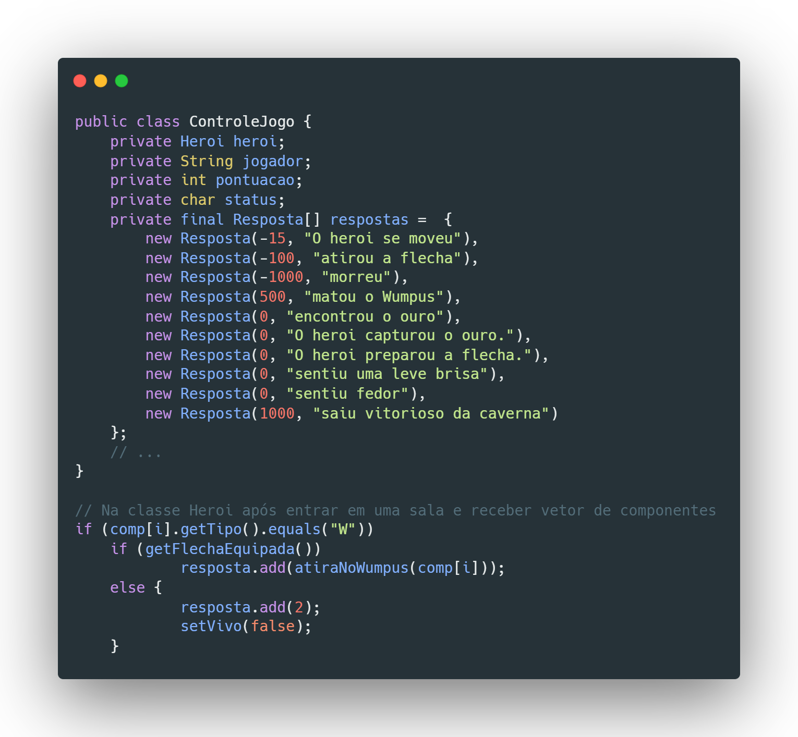

# Lab05 - Mundo de Wumpus

## Arquivos Java sobre Mundo de Wumpus

> [Arquivos Java - Mundo de Wumpus](src/pt/c40task/l05wumpus)

 

## Destaques de código - Decisões de Arquitetura

- ## _Herança e Classe Abstrata_

  

  

  
 A partir da proposta inicial de arquitetura do projeto, implementamos uma classe Componente que tem atributos e métodos coletivos a serem passados por herança para as classes filhas que aparecem na caverna: Herói, Wumpus, Ouro, Buraco, Brisa e Fedor. Nesse cenário, como a classe Componente não seria instanciada em nenhum momento na caverna, e apenas serviria para implementar os padrões de atributos e métodos, ela foi implementada como uma classe abstrata. Assim, as classes filhas, apenas quando necessitado, alterariam esses atributos a partir do construtor e métodos <i>set</i> herdados e alterariam os métodos a partir de sobrecarga. 

   

- ## _Polimorfismo_

  

  
 Para manter mais de um Componente de tipos diferentes (Heroi, Wumpus, Ouro etc.) na sala foi utilizado o polimorfismo, com a criação de um vetor de objetos Componente (que é a classe pai). Quando esses tipos iriam se incluir na sala, a partir da classe MontadorCaverna, eles seriam declarados como Componente, embora instanciados em suas próprias classes, para poderem ficar no vetor de componentes de cada objeto Sala. 

   

- ## _Expansão para novas classes de Componente_

  

  
 Para facilitar a expansão do código, com adição de novas classes de Componente, foi criado um vetor imutável (<i>final</i>) que armazena as respostas geradas pelos comandos inseridos pelo usuário e pela interação entre objetos Componente distintos. O acesso a essas respostas se dá por meio de seus índices no vetor (por exemplo, no trecho mostrado da classe Heroi, é adicionado índice 2 a um vetor de respostas após o herói ser morto pelo Wumpus).

  
Caso haja desejo de se adicionarem novas classses de Componente, basta adicionar a(s) nova(s) resposta(s) correspodente(s) à interação dessa nova classe com as classes já existentes, e adaptar o código de outros métodos para implementar as novas interações com os novos índices correspondentes. 

